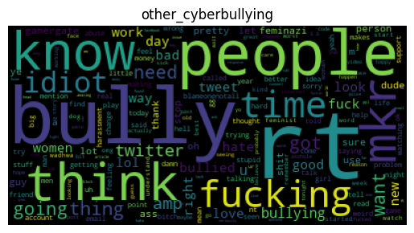

# Cyberbullying Classification Model

## Project Description

For this project, I performed cyberbullying classification on a dataset of tweets on Twitter from a 2020 dataset. The dataset consists of 47692 tweets, each labeled with the type of cyberbullying. There are 6 different classes: age, ethnicity, gender, religion, other_cyberbullying, and not_cyberbullying. The dataset contains about 8000 tweets of each type. More information about this dataset can be found on Kaggle: https://www.kaggle.com/datasets/andrewmvd/cyberbullying-classification?datasetId=1869236

Data preprocessing was performed using spaCy to tokenize and lemmatize the messages, as well as remove all stopwords and non-alpha tokens. Pipelines were implemented to process the text more efficiently. Sentiment analysis was implemented using VADER (Valence Aware Dictionary and sEntiment Reasoner), taking the normalized negative, neutral, and positive scores for each message.

The tweets were converted into into the normalized term-frequency inverse document-frequency (tf-idf) representation using the scikit-learn library. This weights the frequency of words according to how important they are to the document. I also extracted both unigrams and bigrams from the tweets. WordCloud for Python and Matplotlib were used to generate word clouds for each type of cyberbullying.

Data was split for 80% training and 20% testing. I implemented the scikit-learn Multinomial Naive Bayes algorithm for classification. The results of the model were analyzed for accuracy, precision, and recall.

## Results

Below is the average compound sentiment score for each class of cyberbullying. The average scores are all negative, though to varying degrees. The scores for age, gender, and religion are similar, while ethnicity has the strongest negative sentiment. Both other_cyberbullying and not_cyberbullying have scores closer to 0, indicating that these messages are, on average, less negative than other types of cyberbullying.

age: -0.35374030280280283
ethnicity -0.6236070342921742
gender -0.3010298883732597
religion -0.3021480995248812
other_cyberbullying -0.07116475776556308
not_cyberbullying -0.046767589679043424

The model achieved an overall accuracy of 74%. However, precision and recall were low for both other_cyberbullying and not_cyberbullying classes. The lower scores in other_cyberbullying and not_cyberbullying is likely due to the fact that the frequently used words in both classes are very similar and also appear in other cyberbullying classes, and can be easily confused for other classes. In the confusion matrix below, we can see that these classes are frequently predicted as other types of cyberbullying.

Displayed below are the generated word clouds for each cyberbullying class. Note that the words appearing in the word clouds for other_cyberbullying and not_cyberbullying are very similar.

